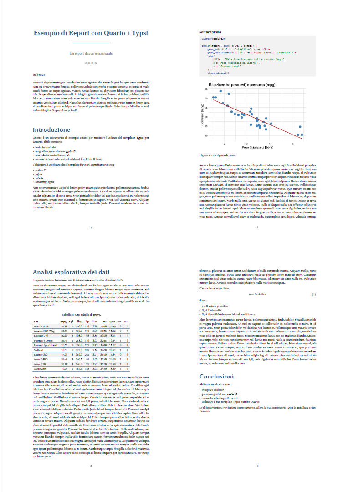

# Template Quarto-SimpleReport-Typst

Un template Quarto + Typst pensato per report brevi o documenti tecnici.
Lo stile è sobrio, pulito e moderno, con particolare attenzione alla leggibilità, ai grafici, alle tabelle e agli elementi tipografici chiari.


## Caratteristiche principali

- Titolo principale centrato con una riga decorativa sottostante
- Titoli di sezione in colore blu scuro
- Testo in sans serif
- Stile uniforme per testi, figure, tabelle e blocchi di codice
- Margini ottimizzati e spaziatura equilibrata tra gli elementi
- Layout pensato per documenti tecnici compatti visualizzati a monitor o stampati non rilegati.

[](https://andreabz.github.io/quarto-simplereport-typst/template.pdf)

## Installazione

Per aggiungere il template a una directory esistente:

```bash
quarto install extension andreabz/quarto-simplereport-typst
```

Oppure puoi creare un nuovo progetto basato sul template con un file `.qmd`:

```bash
quarto use template andreabz/quarto-simplereport-typst
```

Per replicare totalmente il template è necessario copiare la struttura e il contenuto della cartella `static/fonts` all'interno della cartella principale del progetto.

## Utilizzo

1. Scrivi il tuo documento `.qmd` specificando il formato nell'intestazione `yaml`:

```yaml
format: 
  simplereport-typst:
    css-property-processing: none
    font-paths: static/fonts/
```
2. Renderizza il documento:

```bash
quarto render documento.qmd
```

Il PDF risultante utilizzerà automaticamente layout, font e regole tipografiche del template.

## Requisiti

- Quarto >= 1.6.37
- Typst >= 0.11
- R >= 4.4.3